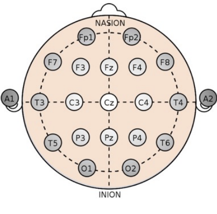
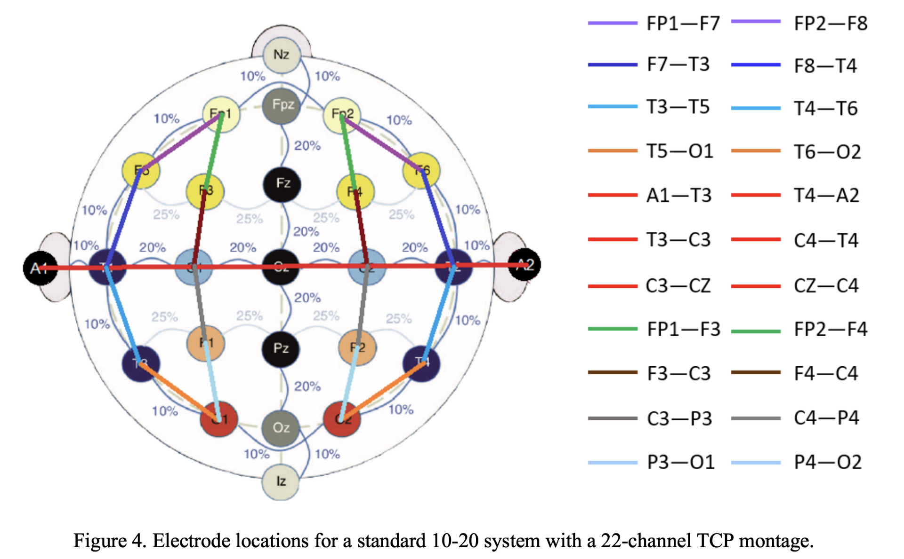

# Notes on the TUH-EEG Dataset
```
@FrexG
July, 2023
EAII
```
## Dataset Description
- Data is organized by `patient` and `session`.
- Each session contains `EEG` signal data stored in `EDF` forma and a de-identified report written by a neurologist.
- Only `19` EEG channels + two supplementary channels (`heart-rate` & `photic stimulation`) were used during annotation.
- Each file is transcribed in two ways:
	- **Channel-based**: refers to labeling of the start and end time of an event on a specified channel.
	- **Term-based**: Summarization of the channel-based annotations, all channels share the same annotation.
- Training set includes 265 patients.
- Evaluation set includes 50 patients, 34% of the evaluation dataset files contain seizures.
### Electrode Location and Channel Labels
``` Electrode placemenet -> Physical configuration ```

``` Differential voltage recording -> unipolar montage ```
> Each channel is identified by a label

>  The specific electrode location that corresponds to each of these labels is not known.

>  `Bipolar montage` : a list of channel pairs to be differenced.
A bipolar montage is imposed when the data is viewed or processed and is not stored in the data file.

#### Physical Configuration of the Electrodes
Arrangement of the electrodes used is *International 10/20 system*. In this system , 21 electrodes on the scalp are evenly distributed.
Distance between electrodes being either 10% or 20% of the total distance from nasion(front) to inion(back).
`nasion`: point between the forehead and nose.
`inion`: Lowest point of the back of the skull.


#### Unipolar Montages Used for Recording.
- A digital EEG signal must be recorded as a 	`differential` voltage must be recorded.
-  Differential voltages are used because differential voltages reduce noise.
-  `Unipolar montage` referes to the difference between the electrical potential recorded at an `electrode -> raw signal` and `reference node`.
-  `unipolar montage` is what is recorded as a digital signal in a data file.
-  All channels are collected as differential voltages and configuration of reference points is implied by the data.
Two unipolar montages are used in TUH-EEG corpus:
	-	 **Average Reference(AR)**: Use the `average` of certain number of electrodes as the reference.
	-	**Linked Ears Reference(LE)**: Uses a lead adapter to link the left and right ears. LE montage is believed to reduce artifacts.
	
The `LE` and `AR` montages used in TUH-EEG are divided into four classes:
1.  `01_tcp_ar`: Uses AR referencing method for the electrodes.
2.  `02_tcp_le`: Uses LE referencing method for the electrodes.
3.  `03_tcp_ar_a`: AR method but collected with only 20 channesl, excluding `A1` and `A2` electrodes.
4.  4.  `04_tcp_le_a`: LE methoed but collected with only 20 channels excluding `A1` and `A2` electrodes. 
	
TCP_AR
***
| Channel | Label | Montage Component | Channel | Label | Montage  Component |
|---------|-------|-------------------|---------|-------|--------------------|
|0| Fp1-F7 | EEG FP1-REF – EEG F7-REF |11| CZ-C4 | EEG CZ-REF – EEG C4-REF |
|1| F7-T3 | EEG F7-REF – EEG T3-REF |12| C4-T4 | EEG C4-REF – EEG T4-REF |
|2| T3-T5 | EEG T3-REF – EEG T5-REF |13| T4-A2 | EEG T4-REF – EEG A2-REF |
|3| T5-O1 | EEG T5-REF – EEG O1-REF |14| Fp1-F3 | EEG FP1-REF – EEG F3-REF |
|4| Fp2-F8 | EEG FP2-REF – EEG F8-REF |15| F3-C3 | EEG F3-REF – EEG C3-REF |
|5| F8-T4 | EEG F8-REF – EEG T4-REF |16| C3-P3 | EEG C3-REF – EEG P3-REF |
|6| T4-T6 | EEG T4-REF – EEG T6-REF |17| P3-O1 | EEG P3-REF – EEG O1-REF |
|7| T6-O2 | EEG T6-REF – EEG O2-REF |18| Fp2-F4 | EEG FP2-REF – EEG F4-REF |
|8| A1-T3 | EEG A1-REF – EEG T3-REF |19| F4-C4 | EEG F4-REF – EEG C4-REF |
|9| T3-C3 | EEG T3-REF – EEG C3-REF |20| C4-P4 | EEG C4-REF – EEG P4-REF |
|10| C3-CZ | EEG C3-REF – EEG CZ-REF|21| P4-O2 | EEG P4-REF – EEG O2-REF |


TCP_LE
***
| Channel | Label | Montage Component | Channel | Label | Montage  Component |
|---------|-------|-------------------|---------|-------|--------------------|
|0| Fp1-F7 | EEG FP1-REF – EEG F7-REF |11| CZ-C4 | EEG FP1-LE – EEG F7-LE |
|1| F7-T3 | EEG F7-REF – EEG T3-REF |12| C4-T4 | EEG F7-LE – EEG T3-LE |
|2| T3-T5 | EEG T3-REF – EEG T5-REF |13| T4-A2 | EEG T3-LE – EEG T5-LE |
|3| T5-O1 | EEG T5-REF – EEG O1-REF |14| Fp1-F3 | EEG T5-LE – EEG O1-LE |
|4| Fp2-F8 | EEG FP2-REF – EEG F8-REF |15| F3-C3 | EEG FP2-LE – EEG F8-LE |
|5| F8-T4 | EEG F8-REF – EEG T4-REF |16| C3-P3 | EEG F8-LE – EEG T4-LE |
|6| T4-T6 | EEG T4-REF – EEG T6-REF |17| P3-O1 | EEG T4-LE – EEG T6-LE |
|7| T6-O2 | EEG T6-REF – EEG O2-REF |18| Fp2-F4 | EEG T6-LE – EEG O2-LE |
|8| A1-T3 | EEG A1-REF – EEG T3-REF |19| F4-C4 | EEG A1-LE – EEG T3-LE |
|9| T3-C3 | EEG T3-REF – EEG C3-REF |20| C4-P4 | EEG T3-LE – EEG C3-LE |
|10| C3-CZ | EEG C3-REF – EEG CZ-REF |21| P4-O2 | EEG C3-LE – EEG CZ-LE |

#### Channel Labels
- Channels labeling is in a non-standard set of labels.
- *First channel stored in an EDF file doesn't always represent the same electrode location*
- Each electrode begins with a letter corresponding to the region where the signals are read from:
	- `Fp`: Pre-frontal
	- `F`: Frontal
	- `T`:Temporal
	- `C`:Central
	- `P`:Parietal/Parasagittal
	- `O`:Occipital
	- `A`: Mastoid Process
- `Even numbers` denote electrodes on the right hemisphere
- `Odd numbers` denote electrodes on the left hemisphere
- `Z` referes to electrodes located on the midsagittal line.


#### Bipolar Montages Used for Viewing.
- Differential voltages are used to reduce noise and enhance events of interest.
- TUH-EEG corpus uses tghe `Temporal Central Parasagittal (TCP)` montages for EEG interpretation.
- TCP montage uses signals that correspond to the difference between two adjacent electrodes.
- It can be in the nasion-inion/longitudinal direcetion, or transverse across the scalp (left-to-right).

## Annotations
Annotations are strored in two formats:
- `.lbl`: represents an annotation as a heirarchical graph
- `.tse`: a time-synchornous event file, that represents an annotation as a flat series of events with start and stop times, type of seizure, and probablitiy.

There are six types of files in the corpus:
- `.edf`: the EEG sampled data in European Data Format (edf)
- `.txt`: the EEG report corresponding to the patient and session
- `.tse`: term-based annotations using all available seizure types (multi-class)
- `.tse_bi`: same as *.tse except only two types of labels are used (bi-class: seizure/background) 
- `.lbl`: event-based annotations using all available seizure types (multi-class)
- `.lbl_bi`: same as *.lbl except only two types of labels are used (bi-class: seizure/background)

### Annotation Labels
#### Types of Seizures - Annotation
1) `SEIZ`: Seizure
2) `GNSZ`: Generalized Non-Specific Seizure 
3) `TNSZ`: Tonic Seizure 
4) `FNSZ`: Focal Non-Specific Seizure 
5) `CNSZ`: Clonic Seizure 
6) `SPSZ`: Simple Partial Seizure 
7) `TCSZ`: Tonic Clonic Seizure 
8) `CPSZ`: Complex Partial Seizure 
9) `ATSZ`: Atonic Seizure 
10) `ABSZ`: Absence Seizure 
11) `MYSZ`: Myoclonic Seizure 
#### File Formats
1) **Time-Synchronous Event (.tse) format.**
	- Provides `term based` annotation and incorporates all available seizure type classes.
	- Uses one label that applies to all channels for each event.
	- Overall classification of a segment is the only concern, not the individual channels.
	- Version of teh tse file is defined on the first line of each file.
	- `start-time` `stop-time` `label` `probablitiy`
2) **Label (*.lbl) format.**
	-  Provides an `event based` annotation.
	-  Describe the specific channel or set of channels on which an evnet occurrred.

	**Structure of .lbl file**
	- `Montage Block`: name/value pair that lists each component of the montage using the channel index, the label, and the labels for the original channels used to form this output channel.
	- `Level Block`:  Describes the number of levels and sub-levels.
	- `Symbol Block`: Defines the symbol used for annotation. Mapping of text labels to indices.
